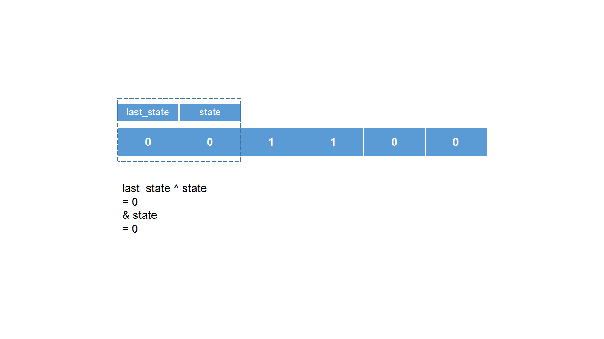
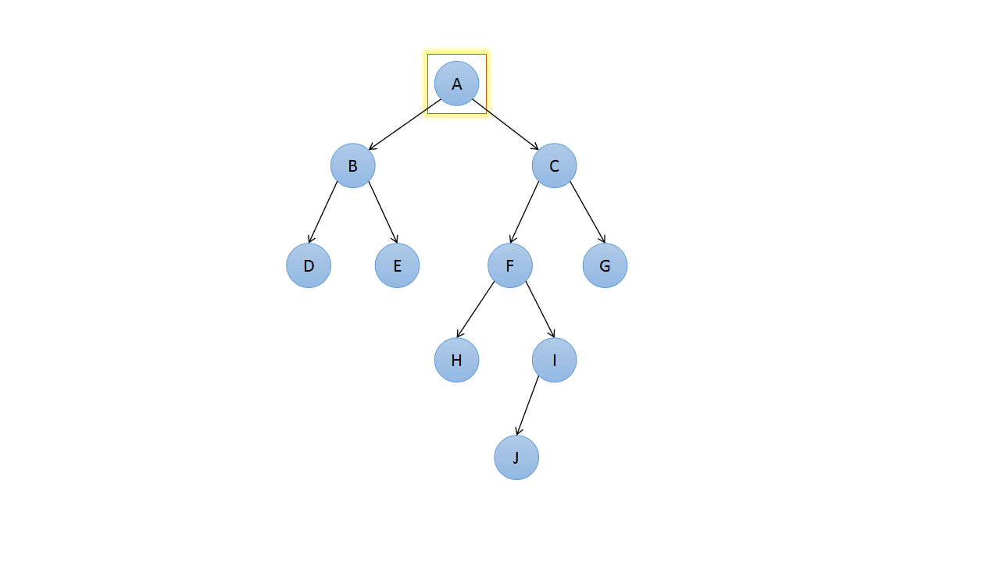

# ppt2gif

`python`包，实现`ppt`转`gif`

需求是写算法介绍博客的时候，需要做动图。动图里面有图表和箭头这些图形，部分形状要逐帧移动。用来用去还是 PPT 做出来的图表最好看，还有自动对齐功能，效率也很高。然后就是把 PPT 转成 gif 了，因为网上没有类似的包，所以自己写了一个。

github 链接: https://github.com/AdjWang/ppt2gif

## 安装

使用`pip`安装：

```
pip install ppt2gif
```

或者到`github`上下载源码，然后在本地安装：

```shell
git clone https://github.com/AdjWang/ppt2gif.git
cd ./ppt2gif
python setup.py install
```

**目前只能在`windows`系统上使用**

## 使用方式

把一堆`PPT`转成`gif`，假设存放`PPT`的目录是`C:\\Users\\Administrator\\Desktop\\myPPTs`，输出的`gif`存放在相同目录下；转换的`gif`每秒切一帧，无限循环播放。实现这个功能只需要如下代码：

```python
import ppt2gif
ppt_obj = ppt2gif.PPT("C:\\Users\\Administrator\\Desktop\\myPPTs")
ppt_obj.convert2gif(duration=1, loop=-1)    # gif loop infinitely if loop=-1
```

除了目录，还可以直接输入文件或者文件列表，下面的输入都是可以识别的：

```python
"C:\\Users\\Administrator\\Desktop\\myPPTs"
"C:\\Users\\Administrator\\Desktop\\myPPTs\\temp.ppt"
"C:\\Users\\Administrator\\Desktop\\myPPTs\\temp.pptx"
["C:\\Users\\Administrator\\Desktop\\myPPTs\\temp.pptx", ...]
```

程序先把`PPT`转换成`png`，然后再把`png`转换成`gif`。
输出的`png`存放在一个文件夹里，该文件夹存放位置与输入的`PPT`相同。此外，如果不想把输出的`png`图片删掉，可以通过参数`del_png`控制：

```python
import ppt2gif
ppt_obj = ppt2gif.PPT("C:\\Users\\Administrator\\Desktop\\myPPTs")
ppt_obj.convert2gif(duration=1, loop=-1, del_png=False)
```

如果不需要`gif`，只需要`png`图片文件，可以直接使用下面的方法：

```python
import ppt2gif
ppt_obj = ppt2gif.PPT("C:\\Users\\Administrator\\Desktop\\myPPTs")
ppt_obj.convert2png()
```

## 注意事项

1. 如果转换过程中发生意外中断。
   
   中断后重新执行程序，会自动跳过已经生成的文件。但是在第一个阶段，即生成`png`图片的阶段，程序只识别`png`存放的文件夹而不是单个`png`文件，所以可能导致被中断的`PPT`继续处理的时候图片输出不完全。这时需要手动删除该`PPT`对应的存放`png`图片的文件夹，然后重新执行程序。

2. 平台限制。因为依赖`win32com`包，所以暂时仅支持`windows`系统。

## 转换效果






